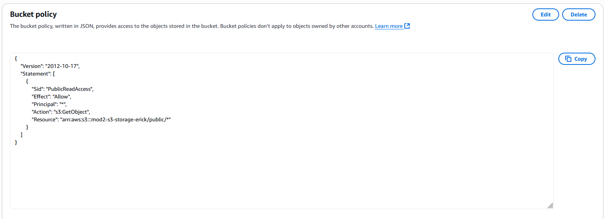
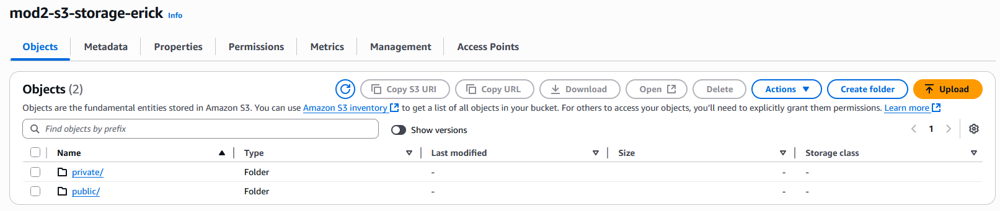
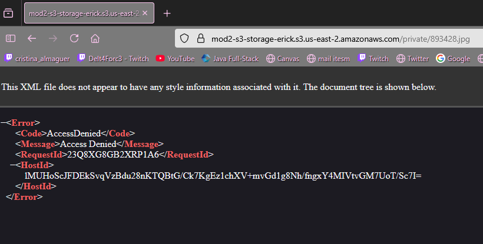
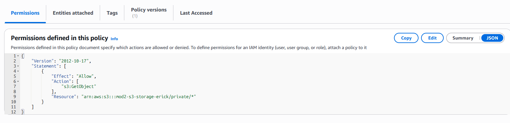
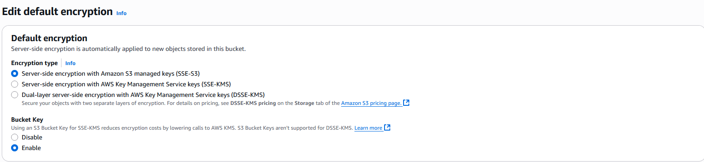

# Module 2: S3 File Storage Assignment

## Overview

This assignment demonstrates the configuration and use of Amazon S3 for file storage, including public and private access control, security management, and temporary access through pre-signed URLs.

---

## 🧩 Part 1: Create and Configure an S3 Bucket

1. **Login to AWS**  
   Accessed the AWS Management Console and navigated to the S3 service.

2. **Create a New Bucket**

   - Bucket Name: `mod2-s3-storage-erick`
   - Region: `us-east-2`

3. **Block Public Access Settings**

   - Disabled public access block for the bucket to allow public file sharing (configured selectively).

4. **Enable Versioning**
   - Versioning was **enabled** to track changes and maintain file history.

---

## 🔒 Part 2: Implement Public and Private Access

1. **Upload Files**

   - Uploaded multiple test files (`image.jpg`, `document.pdf`, `notes.txt`) to the bucket.

2. **Public Access Configuration**

   - For `public/` folder:
     - Updated bucket policy to allow `s3:GetObject` for public access.
     - Alternatively, set individual object-level permissions.

3. **Private Access Configuration**

   - Restricted access to files in `private-files/` using IAM policies.
   - Created a custom IAM role with `s3:GetObject` permission only for specific users/groups.

4. **Testing Access**
   - Verified that public files were accessible via browser.
   - Private files returned **Access Denied** unless accessed by an authorized IAM role.
     
Bucket Policy
  

Folders
  

Public File
  

Private File

---

## 🛡️ Part 3: Manage File Storage and Security

1. **Bucket Policies and ACLs**

   - Configured bucket policies to restrict access based on file paths and user roles.
   - No custom ACLs were set; relied on bucket policies and IAM for security.

2. **IAM Roles**

   - Created IAM roles to allow granular access:
     - Role for Admins: Full S3 access.
     - Role for Users: Limited `GetObject` permission on private folders.

3. **Pre-Signed URLs**

   - Generated pre-signed URLs using AWS CLI to allow temporary access to private files.
   - Set expiration time to 5 minutes for testing.

4. **Encryption**
   - Enabled **SSE-S3** (Server-Side Encryption with Amazon S3 managed keys).
   - Ensured that all uploaded files were encrypted at rest.

Accesing to private file using pre-signed URLs

     
Role Policy

  
Encryption

---

## ✅ Conclusion

This setup demonstrates how to:

- Use Amazon S3 for secure and flexible file storage.
- Manage public and private file access with IAM and policies.
- Enable versioning and encryption for safety and compliance.
- Generate pre-signed URLs to temporarily share private content.

